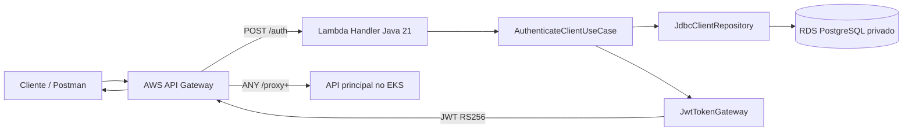
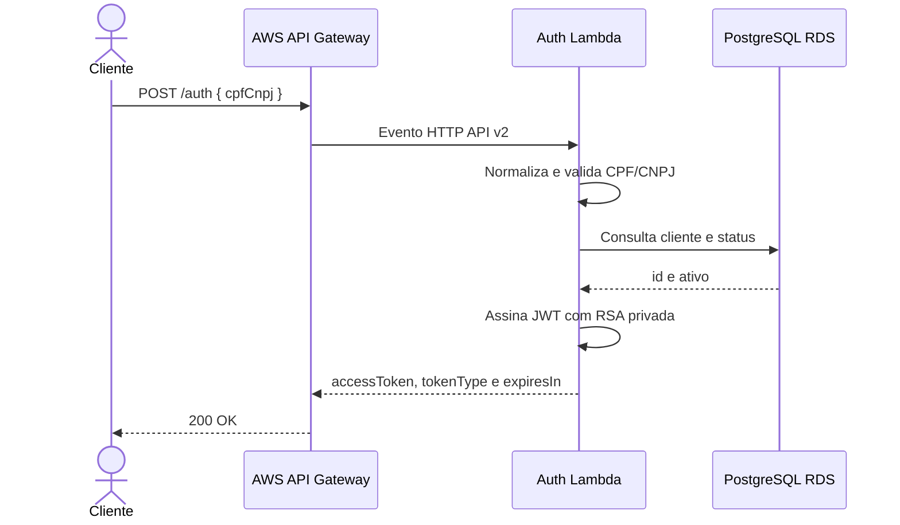

# Mecânica Auth Lambda — Tech Challenge Fase 3

Function Serverless responsável por autenticar clientes por CPF ou CNPJ e
emitir tokens JWT RS256 para consumo das rotas protegidas da aplicação.

Este é um dos quatro repositórios da solução. Ele contém a função Java 21, os
testes, o empacotamento para AWS Lambda e o Terraform do API Gateway e da
própria Lambda.

## Responsabilidades

- normalizar e validar CPF e CNPJ, com ou sem máscara;
- consultar a existência e o status ativo do cliente no PostgreSQL gerenciado;
- não revelar se um documento específico existe ou está inativo;
- gerar JWT de curta duração assinado com chave privada RSA;
- disponibilizar `POST /auth` por meio do AWS API Gateway;
- encaminhar as demais rotas do Gateway para a aplicação no EKS;
- executar dentro da VPC para acessar o Amazon RDS privado.

## Fluxo de autenticação

### Componentes deste repositório



O Terraform deste repositório provisiona API Gateway, Lambda, integrações,
permissões de invocação e acesso de rede ao banco. A função utiliza a role
preexistente do AWS Academy e não cria recursos IAM.



A chave privada existe somente na Lambda. A aplicação principal recebe apenas
a chave pública correspondente, portanto valida tokens sem poder emitir novos.

O mesmo API Gateway também funciona como ponto de entrada da solução. A rota
mais específica `POST /auth` invoca a Lambda; as demais rotas são encaminhadas
por proxy HTTP ao Load Balancer da aplicação no EKS. As rotas sensíveis continuam
validando o JWT RS256 na aplicação.

## Contrato HTTP

```http
POST /auth
Content-Type: application/json

{"cpfCnpj":"529.982.247-25"}
```

Resposta de sucesso:

```json
{"accessToken":"<jwt>","tokenType":"Bearer","expiresIn":900}
```

Documentos inválidos e clientes inexistentes/inativos não expõem dados
internos. O CPF/CNPJ não é incluído no JWT.

Documentação consumível:

- [Swagger da aplicação pelo API Gateway](https://3o3iqeu0b9.execute-api.us-east-1.amazonaws.com/swagger-ui/index.html)
- [Coleção Postman da solução, incluindo `POST /auth`](https://github.com/Mateusborg98/mecanica-api/blob/main/docs/postman/mecanica-fase3.postman_collection.json)
- [Arquitetura completa](https://github.com/Mateusborg98/mecanica-api/blob/main/docs/architecture.md)

O Swagger é produzido pela aplicação Spring; por isso a rota implementada
nesta Lambda está registrada na coleção Postman e no contrato acima.

## Arquitetura do código

```text
domain/          regras de CPF/CNPJ e entidades independentes de framework
application/     caso de uso e portas ClientRepository/TokenGateway
infrastructure/  JDBC, JWT, configuração e adaptação para AWS Lambda
presentation/    modelos e tradução das respostas HTTP
infra/           Terraform da Lambda, API Gateway, rede e security group
```

O caso de uso depende de interfaces, não de JDBC ou AWS. Assim, a regra pode
ser testada sem banco real e os detalhes de infraestrutura podem ser trocados.

## Tecnologias

Java 21, Maven Wrapper, AWS Lambda, API Gateway HTTP API, JDBC, PostgreSQL,
JJWT/RS256, Terraform, GitHub Actions, JUnit 5, H2 e JaCoCo.

## Testes e cobertura

```powershell
.\mvnw.cmd clean verify
```

O comando compila, executa os testes, verifica a cobertura JaCoCo e gera:

- testes em `target/surefire-reports/`;
- cobertura em `target/site/jacoco/index.html`;
- pacote de deploy em `target/*-aws.jar`.

Os testes usam H2 quando exercitam JDBC. Nenhuma conta AWS é necessária.

Validação local do Terraform sem acessar o backend remoto:

```powershell
terraform -chdir=infra init -backend=false
terraform -chdir=infra fmt -check
terraform -chdir=infra validate
```

## Configuração

| Variável | Finalidade |
|---|---|
| `DB_URL` | URL JDBC do PostgreSQL. |
| `DB_USERNAME` | Usuário do banco. |
| `DB_PASSWORD` | Senha do banco. |
| `JWT_PRIVATE_KEY` | Chave RSA privada PEM PKCS#8. |
| `JWT_ISSUER` | Emissor, padrão `mecanica-auth`. |
| `JWT_EXPIRATION_SECONDS` | Validade do token em segundos. |

Segredos reais não são versionados nem exibidos nos logs.

## Infraestrutura e CI/CD

O Terraform reutiliza a VPC do Learner Lab, lê o estado remoto do banco e cria
a Lambda Java 21, o API Gateway, a rota `POST /auth`, o proxy para o EKS,
integrações, permissões e security group. O estado fica no S3, separado por
ambiente.

Configure nos environments `homolog` e `production`:

| Tipo | Nome | Observação |
|---|---|---|
| Secret | `DATABASE_PASSWORD` | Mesma senha do RDS. |
| Secret | `JWT_PRIVATE_KEY` | Chave privada completa. |
| Secret | `LAMBDA_ROLE_ARN` | Role permitida pelo Learner Lab. |
| Secret | `TF_STATE_BUCKET` | Bucket dos states Terraform. |
| Secret | `AWS_ACCESS_KEY_ID` | Credencial temporária. |
| Secret | `AWS_SECRET_ACCESS_KEY` | Credencial temporária. |
| Secret | `AWS_SESSION_TOKEN` | Token temporário. |
| Variable | `APPLICATION_BASE_URL` | URL pública do serviço no EKS, por exemplo `http://<load-balancer>:8080`. |

Somente as três credenciais AWS temporárias são renovadas a cada nova sessão.

```text
feature/* -> Pull Request -> homolog -> Pull Request -> main
```

- `Lambda CI`: testes, cobertura, pacote e validação Terraform;
- `Lambda CD`: deploy automático após push em `homolog` ou `main`;
- branches protegidas contra commit direto;
- check obrigatório `Build and test` e merge por Pull Request.

## Validação após o deploy

```powershell
$body = @{ cpfCnpj = "52998224725" } | ConvertTo-Json
Invoke-RestMethod -Method Post -Uri "https://<api-id>.execute-api.us-east-1.amazonaws.com/auth" -ContentType "application/json" -Body $body
```

A resposta deve conter `accessToken`, `tokenType` igual a `Bearer` e expiração
positiva. Use o mesmo domínio do Gateway para consumir uma rota protegida:

```powershell
$headers = @{ Authorization = "Bearer $($auth.accessToken)" }
Invoke-RestMethod -Method Get -Uri "https://<api-id>.execute-api.us-east-1.amazonaws.com/ordens-servico" -Headers $headers
```

Não publique tokens nem documentos reais nas evidências.

## Custos

Lambda e API Gateway têm custo ocioso muito baixo. RDS e EKS concentram o
consumo; ao finalizar as validações, pare o RDS e destrua o EKS.
